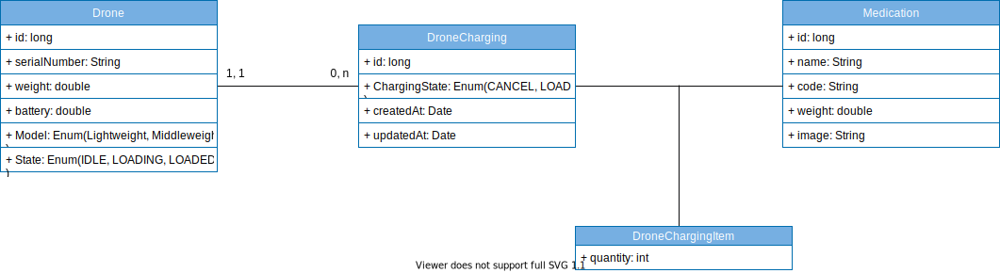

### Drones Management
 
There is a major new technology that is destined to be a disruptive force in the field of transportation: **the drone**. Just as the mobile phone allowed developing countries to leapfrog older technologies for personal communication, the drone has the potential to leapfrog traditional transportation infrastructure.
 
Useful drone functions include delivery of small items that are (urgently) needed in locations with difficult access.
 
---
 
### Task description
 
We have a fleet of **10 drones**. A drone is capable of carrying devices, other than cameras, and capable of delivering small loads. For our use case **the load is medications**.
 
A **Drone** has:
- serial number (100 characters max);
- model (Lightweight, Middleweight, Cruiserweight, Heavyweight);
- weight limit (500gr max);
- battery capacity (percentage);
- state (IDLE, LOADING, LOADED, DELIVERING, DELIVERED, RETURNING).
 
Each **Medication** has: 
- name (allowed only letters, numbers, ‘-‘, ‘_’);
- weight;
- code (allowed only upper case letters, underscore and numbers);
- image (picture of the medication case).
 
We are going to develop a service via REST API that allows clients to communicate with the drones (i.e. **dispatch controller**).
The specific communicaiton with the drone is outside the scope of this task. 
 
### Features
The service should allow:
- Registering a drone;
- Loading a drone with medication items;
- Checking loaded medication items for a given drone; 
- Checking available drones for loading;
- Check drone battery level for a given drone;
 
<!-- > Feel free to make assumptions for the design approach.  -->
 
---
 
### Requirements
 
We have implemented solution **with the following requirements**: 
 
#### Functional requirements
 
- There is no need for UI;
- Prevent the drone from being loaded with more weight that it can carry;
- Prevent the drone from being in LOADING state if the battery level is **below 25%**;
- Introduce a periodic task to check drones battery levels and create history/audit event log for this.
 
 
#### Non-functional requirements
 
- Input/output data is in JSON format;
- Project is buildable and runnable;
- Project run with DB inMemmory
- Data will preload in the database on application boot.
- Partial unit testing for services ;

---
### Modeling

In this case study, we assume that
- each drone can perform medication transfer repeatedly.

- drones and medications are identified and saved in the database

- We want to keep the information for each medication delivery. And the delivered quantity of each medication.

We offer the class diagram below

